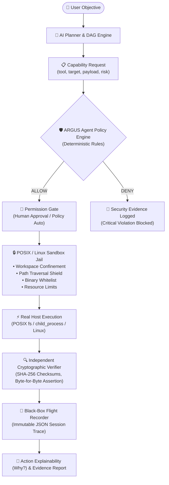

# 🏛️ ARGUS 2.0 — Architecture Specification

> **"ARGUS does not replace Linux. ARGUS makes Linux agent-native."**

---

## ⚡ The Architectural Thesis

ARGUS is not a general-purpose operating system built from scratch. It is an **Agent Governance and Execution Layer for Linux that makes AI agents controllable, auditable, and permission-bounded**.

Linux provides mature, world-class infrastructure — kernel, cgroups, namespaces, seccomp, filesystems, device drivers, GPU acceleration, and networking.

ARGUS provides the essential layer the modern AI era is missing:
> **How should an AI agent be allowed to operate a computer?**

---

## 🧱 The Product Tier Hierarchy

```text
  ARGUS Runtime         ─── Central execution & governance daemon (argusd)
  ARGUS Desktop         ─── Reference management interface & client (React / Tauri)
  ARGUS SDK             ─── Developer ecosystem & capability definitions (@argus/sdk)
  ARGUS Control Plane   ─── Enterprise governance, policies, and telemetry
  ARGUS Linux           ─── Optional turnkey Linux distribution (ISO)
```

---

## 🔒 ARGUS Defence-in-Depth Architecture (10 Layers)

| Defense Layer | Subsystem | Responsibility |
| :--- | :--- | :--- |
| **Layer 1: Identity** | `AgentIdentity` | Unique `agent_id`, `session_id`, `mission_id`. No anonymous execution. |
| **Layer 2: Capability Tokens** | `CapabilityTokenManager` | Scoped, cryptographically signed JSON capability tokens (HMAC-SHA256). |
| **Layer 3: Path Security** | `PolicyEngine` | Canonical path resolution (`fs.realpathSync`). Rejects `../`, symlinks, and escapes. |
| **Layer 4: Process Isolation** | `SandboxExecutor` | Subprocess isolation, clean environment variables, restricted execution scope. |
| **Layer 5: Resource Limits** | `SandboxExecutor` | Execution timeouts (8000ms max), buffer limits, CPU/memory confinement. |
| **Layer 6: Network Isolation** | `NetworkShield` | Deny-by-default network policy, explicit domain allowlist, SSRF metadata filtering. |
| **Layer 7: Secret Protection** | `CredentialShield` | Intercepts `/etc/shadow`, `~/.ssh/id_*`, `.env`, `.aws`, private certificates. |
| **Layer 8: Human Approval Gate** | `ApprovalGate` | Explicit clearance barrier for high-risk operations (file deletion, network egress). |
| **Layer 9: Independent Verification** | `IndependentVerifier` | Cryptographic SHA-256 signatures, byte-level file assertions on disk. |
| **Layer 10: Immutable Evidence & Why**| `FlightRecorder` | Black-box JSON traces + explainable telemetry (`argus why`, `argus audit`). |

---

## 🔄 The Real Execution Pipeline



---

## 📊 Red Team Validation Status

Validated by `argus security-test` (20-Point Adversarial Matrix):

- **Workspace File Operations**: REAL & SHA-256 Verified
- **Path Traversal & Symlink Defense**: BLOCKED
- **Credential Harvesting (`/etc/shadow`, `~/.ssh`, `.env`)**: BLOCKED
- **Dangerous Commands (`sudo`, `rm -rf /`, `fork bomb`)**: BLOCKED
- **SSRF & Cloud Metadata (`169.254.169.254`)**: BLOCKED
- **Adversarial Prompt Injections**: BLOCKED
- **Hallucinated Execution Claims**: VERIFICATION FAILED
- **Subprocess Execution & Timeouts**: REAL (Terminated at timeout limit)
- **Flight Recorder Persistence**: VERIFIED
