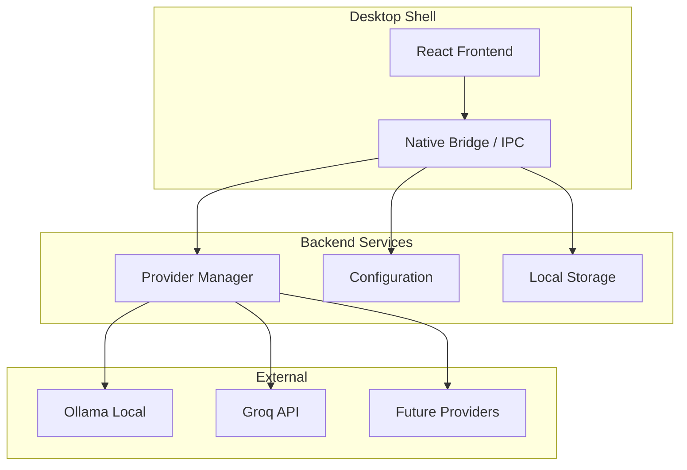
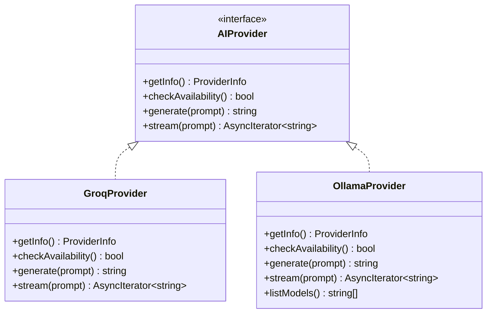
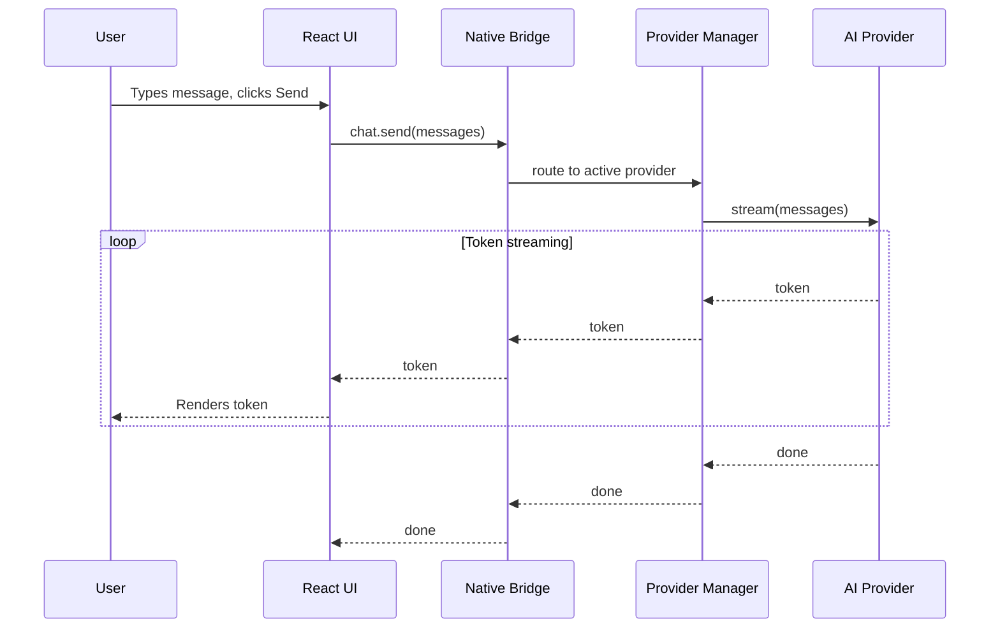
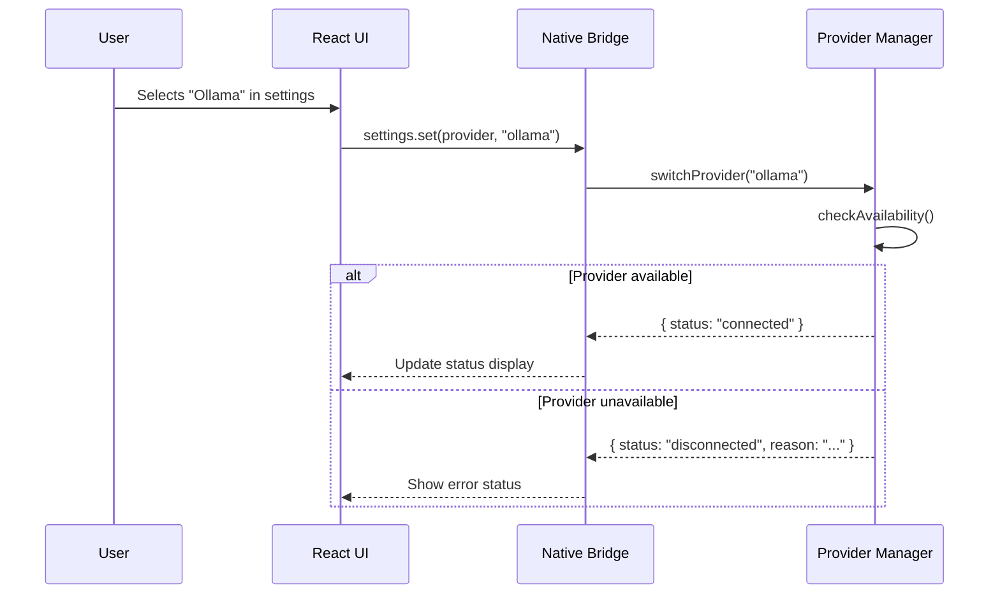

# ARGUS — Architecture

## Overview

ARGUS is a cross-platform desktop application with a web-based UI served inside a native shell. The architecture follows a layered design with clear boundaries between the UI, backend services, and external integrations.



## Major Components

### 1. Desktop Shell (Tauri or Electron)

**Responsibility:** Provide the native window, system tray, file dialogs, and secure bridge between the web UI and backend services.

**Security boundary:** The UI runs in a sandboxed WebView with no direct access to the filesystem, network, or OS APIs. All operations go through a controlled bridge.

### 2. React Frontend

**Responsibility:** Render the user interface — chat view, settings, provider status, conversation list.

**Key properties:**
- Component-based architecture
- CSS Modules for styling
- No direct backend/network access (everything goes through the bridge)
- Responsive to provider state changes

### 3. Native Bridge / IPC

**Responsibility:** Expose a minimal, allowlisted set of commands that the UI can invoke.

**Commands (planned):**
- `chat.send` — send a message, receive streaming response
- `chat.cancel` — cancel in-progress response
- `chat.history` — retrieve conversation history
- `providers.list` — list available providers
- `providers.status` — get current provider status
- `settings.get` / `settings.set` — read/write configuration
- `models.list` — list available models for the active provider

### 4. Provider Manager

**Responsibility:** Route AI requests to the correct provider implementation.

**Design:**
- Maintains a registry of provider implementations
- Each provider implements a common `AIProvider` interface
- Handles provider switching, health checks, and error recovery
- Never silently falls back from local to remote



### 5. Configuration Manager

**Responsibility:** Manage application settings, API keys, and provider preferences.

**Security:**
- API keys are stored using OS credential storage (Keychain, credential manager)
- Fallback to encrypted local file if OS storage is unavailable
- Never logged, never included in error messages

### 6. Local Storage

**Responsibility:** Persist conversation history and application state.

**Decision:** OPEN — SQLite (likely) or flat JSON files.

## Data Flow

### Chat Message Flow



### Provider Switch Flow



## Extension Points

1. **New AI providers:** Implement `AIProvider` interface + register in provider manager
2. **New UI views:** Add React components + route definitions
3. **New bridge commands:** Add command handler + allowlist entry
4. **Future subsystems:** Voice, memory, tools — each gets its own interface and manager

## Failure & Recovery Strategy

| Failure | Behavior |
|:---|:---|
| Provider unreachable | Display clear error in UI. Do NOT fall back to another provider silently |
| Ollama not running | Display "Ollama is not running" status. Suggest starting it |
| API key missing | Display "API key not configured" with link to settings |
| Network error during stream | Stop stream, display partial response + error message |
| Malformed API response | Log error, display generic error to user |
| Application crash | Conversation history is persisted; last state is recoverable |

## Security Boundaries

```
┌─────────────────────────────────────────┐
│ WebView (Sandboxed)                     │
│ - No filesystem access                  │
│ - No direct network access              │
│ - No Node.js / Rust APIs               │
│ - Communication only via bridge         │
└──────────────┬──────────────────────────┘
               │ Allowlisted IPC commands only
┌──────────────▼──────────────────────────┐
│ Native Backend (Trusted)                │
│ - Credential storage                    │
│ - Filesystem access                     │
│ - Network requests to providers         │
│ - Process management (Ollama checks)    │
└─────────────────────────────────────────┘
```

## Testing Strategy

| Layer | Tool | Scope |
|:---|:---|:---|
| UI Components | Vitest + React Testing Library | Unit tests for components |
| Provider Logic | Vitest | Unit tests with mocked HTTP |
| Bridge Commands | Vitest | Integration tests |
| End-to-End | Playwright (future) | Full application flows |
| Security | CI secret scan | No committed secrets |
