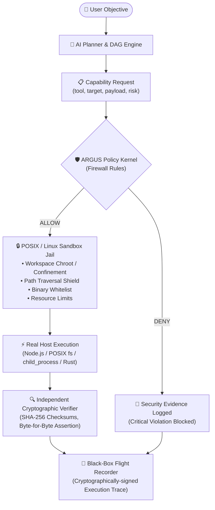

# 🏛️ ARGUS 2.0 — Architecture Specification

> **"ARGUS does not replace Linux. It makes Linux agent-native."**

---

## ⚡ The Architectural Thesis

ARGUS is not a general-purpose operating system built from scratch. It is a **Sovereign AI Agent Runtime, Policy Kernel, and Governance Layer that runs on top of Linux / POSIX systems**.

Linux provides mature, world-class infrastructure — kernel, cgroups, namespaces, seccomp, filesystems, device drivers, GPU acceleration, and networking.

ARGUS provides the essential layer the modern AI era is missing:
> **How should an AI agent be allowed to operate a computer?**

---

## 🧱 The 3-Tier Layered Architecture

```text
                               ARGUS SOVEREIGN SYSTEM
      ┌────────────────────────────────────────────────────────────────────────┐
      │                        ARGUS Desktop & Client                          │
      │  • Mission Control   • Code Studio   • Control Plane   • Web UI / OS   │
      └───────────────────────────────────┬────────────────────────────────────┘
                                          │ (IPC / WebSocket / SDK)
      ┌───────────────────────────────────┴────────────────────────────────────┐
      │                   ARGUS 2.0 AI Agent & Policy Kernel                   │
      │  • AI Planner & DAG Engine       • Zero-Trust Policy Kernel (Firewall) │
      │  • Unified Tool Fabric           • Independent Cryptographic Verifier  │
      │  • 3-Tier Encrypted Memory       • Black-Box Flight Recorder           │
      └───────────────────────────────────┬────────────────────────────────────┘
                                          │ (POSIX System Calls / cgroups / seccomp)
      ┌───────────────────────────────────┴────────────────────────────────────┐
      │                             Linux Platform                             │
      │  • Linux Kernel                  • POSIX Filesystem & Workspace Jail   │
      │  • Process Isolation & Sandbox   • Network Stack & Firewalling         │
      │  • GPU Acceleration / ROCm/CUDA  • Hardware Drivers & Device Tree      │
      └───────────────────────────────────┬────────────────────────────────────┘
                                          │
                                       Hardware
```

---

## 🔄 The Real Execution Pipeline



---

## 🗺️ Progressive Development Roadmap

Rather than building an entire operating system from bare metal, ARGUS follows an evolutionary, high-leverage path:

```text
Phase A: Linux Core & Policy Runtime
    ├── Zero-Trust Policy Kernel
    ├── Tool Fabric (filesystem, process, network, vault)
    ├── Independent Cryptographic Verifier
    └── Black-Box Flight Recorder

Phase B: Autonomous Sovereign Agents
    ├── Developer & Code Synthesizer Agent
    ├── Research & Intelligence Agent
    ├── Security Auditor Agent
    └── Growth & Mission Control Agents

Phase C: 3-Tier Sovereign Memory
    ├── Working Memory (Active DAG State)
    ├── Episodic Memory (Execution & Outcome Traces)
    ├── Semantic Memory (Encrypted Entity Graph)
    └── Local AES-256-GCM Vault

Phase D: ARGUS Desktop & Control Plane
    ├── Mission Control Center
    ├── Code Studio Sandbox
    ├── Sovereign Browser & Terminal
    └── Real-time Telemetry Dashboard

Phase E: ARGUS Linux Distribution (ISO)
    └── Turnkey ISO distribution on Debian/Ubuntu with pre-hardened agent kernel
```

---

## 🛡️ Security Guarantees & Verification

Every capability request is subject to non-bypassable constraints:

| Security Domain | Defense Mechanism | Risk Level |
| :--- | :--- | :---: |
| **Filesystem Jail** | Paths are strictly constrained to `./workspace`. Rejects path traversal (`../`). | **CRITICAL** |
| **Credential Shield** | Blocks access to `/etc/shadow`, `/etc/passwd`, `~/.ssh/id_*`, `.env`, `.aws`. | **CRITICAL** |
| **Command Blackshield** | Blocks `sudo`, `rm -rf`, `chmod 777`, `mkfs`, fork bombs, reverse shells. | **CRITICAL** |
| **Adversarial Injection** | Rejects prompt injection and instruction override attempts. | **CRITICAL** |
| **SSRF Shield** | Blocks raw egress to internal loopbacks and cloud metadata endpoints (`169.254.169.254`). | **CRITICAL** |
| **Independent Verifier** | Verifies file existence, byte matching, and generates SHA-256 signatures before closing tasks. | **VERIFIED** |
| **Flight Recorder** | Logs every action into an immutable JSON black-box trace. | **VERIFIED** |
