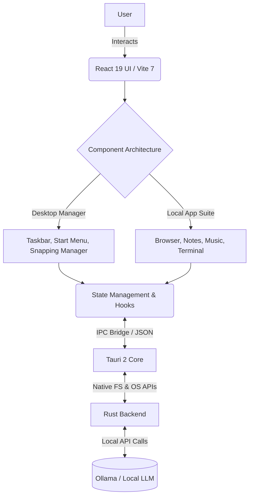

# Building ARGUS: Why I Created the World's First AI-Native Sovereign Desktop Workspace

By R Jan Steve Daniel

## 1. The Problem: AI is a Widget, Not a Citizen

Look at your desktop right now. Whether you are running macOS, Windows 11, or a flavor of Linux, you are looking at a desktop paradigm designed in the 1980s. The core abstractions—files, folders, windows, pointers—have remained static. Over the past three years, generative artificial intelligence has redefined what computing is capable of, yet major OS vendors treat this monumental shift as a mere accessory. 

Microsoft bolted Copilot onto Windows as an intrusive sidebar. Apple injected "Apple Intelligence" as a Siri upgrade and writing tools sprinkled across text fields. None of them make AI a *first-class citizen* at the desktop level. Users are still forced to endure brutal context-switching. If you want an AI to analyze a local file, you have to open a web browser, upload the file to a cloud service, and converse with the AI in an isolated sandbox that forgets everything when you close the tab. The AI has no awareness of your environment, no memory of your filesystem, and no agency within your workspace. 

Furthermore, this cloud-first approach has created a privacy nightmare. Every prompt and document is beamed to remote servers, raising massive security concerns for businesses and privacy-conscious developers.

This disconnected, siloed experience is fundamentally broken. AI shouldn't be an application you run; it should be the canvas on which you compute.

---

## 2. The Vision: The Sovereign Desktop Environment Reimagined

What if AI was the workspace itself? 

That was the guiding question that led to the creation of **ARGUS**. 

ARGUS is a **Sovereign, AI-Native Desktop Environment and Productivity Workspace Wrapper** that sits on top of your existing OS (macOS or Windows). It bridges local AI execution with lightweight, native app widgets inside a unified window manager. In ARGUS, the workspace doesn't just display your data; it comprehends it. 

When you open the File Explorer in ARGUS, it understands the content of your documents. When you open the Terminal, the system autocompletes with deep contextual awareness of your directory. When you browse the web, the workspace reads alongside you, ready to summarize pages instantly. 

ARGUS represents a complete paradigm shift: a productivity workspace where the barrier between user intent and machine execution is dissolved by natural language and ambient local intelligence.

---

## 3. Uncompromising Privacy: The Case for Data Sovereignty

The name "Sovereign" is a functional manifesto. Data sovereignty is the killer feature of the next generation of computing. 

ARGUS runs 100% locally via Ollama. It leverages highly optimized, locally hosted Large Language Models (like Llama 3.2 or Mistral) that run entirely on your own silicon. Your conversations, your code, your documents, your media—none of it ever leaves your local drive. ARGUS ensures that the AI serving you is truly yours, completely immune to internet outages, server deprecations, and corporate data harvesting.

---

## 4. Technical Architecture: Bridging Web Native and Systems Rust

Building a custom window manager is notoriously difficult; building an AI-native one requires a highly specialized architecture. To achieve the fluid responsiveness of a native shell with the flexible styling of modern CSS, I engineered ARGUS on a hybrid stack:

*   **The Core UI (React 19 & TypeScript 5.8):** The visual layer is built using React. By leveraging React 19's rendering model and strict TypeScript typing, the window manager renders concurrent application states smoothly without dropping frames.
*   **The Native Bridge (Tauri 2 & Rust):** Electron is too bloated for overlay desktops. ARGUS utilizes Tauri 2. The backend is written in Rust, handling filesystem operations, window spawning, and heavy computational lifting with zero-cost abstractions and total memory safety. This keeps the memory footprint exceptionally low.
*   **The AI Engine (Ollama):** Rust communicates securely with a local Ollama instance, acting as the brain of the workspace wrapper.

---

## 5. Taming the Ollama Hardware Hurdle

Local LLM execution is resource-heavy. Running a React/Tauri interface while an Ollama model is processing a prompt locally can crush mid-range hardware. ARGUS solves this by introducing three built-in **Performance Profiles** directly in the Settings App:

1.  **Eco Mode:** Caps context limits to 2,048 tokens and suspends background services to keep CPU/GPU temperatures low on older laptops.
2.  **Balanced Mode (Default):** Optimized for general multi-tasking and standard Llama 3.2 execution on Apple Silicon or modern Windows rigs.
3.  **Turbo Mode:** Unlocks the GPU/NPU layer completely and expands the context window to maximize reasoning performance.

### Hardware Prerequisites
-   **macOS:** Apple Silicon M-Series (M1/M2/M3/M4) with 16GB Unified Memory or higher.
-   **Windows:** Intel Core i7 / AMD Ryzen 7, 16GB RAM, and a dedicated NVIDIA RTX GPU.

---

## 6. Cohesive Application Ecosystem & AI Interactivity

An overlay workspace is only as good as the apps it includes. ARGUS ships with a focused suite of default tools, unified directly under the local AI via interactive slash commands:

*   **Chat Assistant:** The central hub of your workspace. By typing commands, the local AI dynamically controls the rest of the application suite:
    - `/notes "text"` — Instructs the AI to save a new note to the Notes app.
    - `/web "url"` — Tells the AI to open and load a website in the Browser app.
    - `/calc "expr"` — Automatically calculates mathematical expressions safely.
    - `/music "play/pause/next"` — Directs the Media Player app.
    - `/system "Eco/Turbo"` — Sets the performance profile of the model.
*   **Browser:** A glassmorphic web browser with custom address inputs, bookmark managers, and built-in AI page summarizers.
*   **Notes:** A markdown editor backing auto-saves directly to localStorage, enabling organic note cataloging.
*   **Terminal:** A simulated UNIX shell offering terminal prompt interactions and command auto-suggestions.
*   **Calculator, Music Player, Photos:** Native productivity widgets built with the custom ARGUS glassmorphism theme, running with absolute fluid efficiency.

---

## 7. The Open-Core License Model: Privacy Meets Business

The local privacy community is fiercely pro-Open Source. If a privacy-focused workspace wrapper is closed-source, users will naturally be skeptical about whether data is secretly logged. 

To address this, ARGUS is built on an **Open-Core** model. The base desktop wrapper, window snapping manager, and core local app widgets are completely open-source (MIT/Source-Available) for transparency. Premium license options are offered for enterprise features, team workspace synchronization, and customized commercial themes, establishing both credibility and business viability.

---

## 8. Conclusion: The Inevitable Future of Desktop Workspaces

Creating ARGUS was a thesis project on what modern computing should look like. We are entering an era where compute is abundant, and intelligence can be run on consumer hardware. There is no longer a valid excuse to offload our thoughts, private documents, and desktop workflows to cloud servers. 

ARGUS proves that a local-first, highly intelligent, and beautiful desktop environment is the future of digital productivity.
