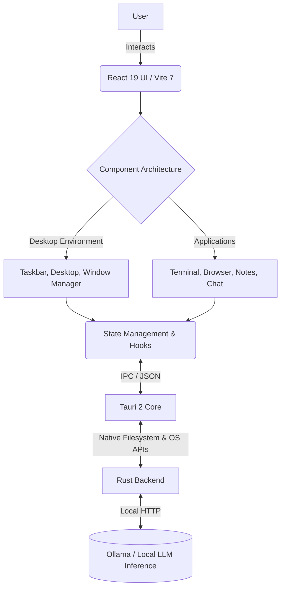

# Building ARGUS Sovereign OS: Why I Created the World's First AI-Native Desktop Operating System

By R Jan Steve Daniel

## 1. The Problem: AI is a Widget, Not a Citizen

Look at your desktop right now. Whether you are running macOS, Windows 11, or a flavor of Linux, you are looking at an operating system paradigm that was fundamentally designed in the 1980s and 1990s. The core abstractions—files, folders, windows, pointers—have remained remarkably static. Over the past three years, generative artificial intelligence has redefined what computing is capable of, yet the major OS vendors have treated this monumental shift as a mere accessory. 

Microsoft bolted Copilot onto Windows as an intrusive sidebar. Apple injected "Apple Intelligence" as a Siri upgrade and a set of writing tools sprinkled across text fields. Google gave us the Gemini web app and sidebar integrations. None of them, however, have made AI a *first-class citizen* at the operating system level. Users are still forced to endure brutal context-switching. If you want an AI to analyze a local file, you have to find the file, open a web browser or a chat app, upload the file, and then converse with the AI in an isolated sandbox that forgets everything the moment you close the tab. The AI has no awareness of your environment, no memory of your filesystem, and no agency within your workspace. 

This disconnected, siloed experience is fundamentally broken. AI shouldn't be an application you run; it should be the environment in which you compute.

## 2. The Vision: The Operating System Reimagined

What if AI wasn't an app you opened, but the operating system itself? 

That was the guiding question that led to the creation of **ARGUS Sovereign OS**. I wanted to build an environment where every single interaction is augmented, accelerated, and understood by intelligence. In ARGUS, the operating system doesn't just store your data; it comprehends it. 

When you open the File Explorer in ARGUS, it doesn't just show you file names and creation dates. It understands the contents of your documents and can summarize them before you even click. When you open the Terminal, you aren't left struggling to remember arcane bash commands; the system autocompletes with deep contextual awareness of the directory you are in and the task you are trying to achieve. When you browse the web, the OS is reading alongside you, ready to distill complex pages into actionable insights.

ARGUS represents a complete paradigm shift. It is a desktop environment where the barrier between the user's intent and the machine's execution is dissolved by natural language and ambient intelligence.

## 3. Why 'Sovereign'? The Case for Data Sovereignty

The name "Sovereign" is not just branding; it is a foundational manifesto. Data sovereignty is the killer feature of the next generation of computing. 

In our current era of cloud-first AI, every prompt, every analyzed document, and every keystroke is beamed to a remote server farm operated by a massive tech conglomerate. Your most sensitive data, your private workflows, and your personal thoughts are processed off-device. This is a profound security and privacy compromise that users have been forced to accept in exchange for convenience.

ARGUS rejects this compromise entirely. Sovereign OS runs 100% locally via Ollama. It leverages highly optimized, locally hosted Large Language Models (LLMs) that run on your own silicon. Your conversations, your documents, your financial records, your code—none of it ever leaves your machine. You own your hardware, and therefore, you should own your intelligence. ARGUS ensures that the AI serving you is truly yours, completely immune to internet outages, server deprecations, and corporate data harvesting.

## 4. Technical Architecture: Bridging Web Native and Systems Rust

Building a Desktop Environment from scratch is notoriously difficult. Building an AI-native one requires a highly specialized architecture. 

To achieve the performance of a native OS shell while maintaining the UI flexibility required for rapid iteration, I engineered ARGUS on a hybrid stack:



**The Core UI (React 19 & TypeScript 5.8):** The entire visual layer is built using cutting-edge React. By leveraging React 19's new primitives and strict TypeScript typing, the window manager can render complex application states concurrently without dropping frames.
**The Native Bridge (Tauri 2 & Rust):** Electron was too bloated. Instead, ARGUS uses Tauri 2. The backend is written in Rust, which handles file system operations, window spawning, and heavy computational lifting with zero-cost abstractions and total memory safety. This keeps the OS shockingly lightweight.
**The AI Engine (Ollama):** Rust securely communicates with a local Ollama instance, acting as the brain of the operating system, orchestrating text generation and contextual analysis seamlessly behind the scenes.

## 5. Design Philosophy: The Glassmorphism Synthesis

An operating system's UI is its soul. I didn't want ARGUS to look like a standard Linux distro or a generic web app. It needed to evoke the premium, futuristic nature of its AI foundation.

I adopted a rigorous **Glassmorphism** design system. By using heavy backdrop filters, semi-transparent panels, and subtle borders, the OS feels like a pane of frosted glass floating over reality. This isn't just about aesthetics; depth in UI helps establish a mental map of Z-index hierarchy, which is crucial for a multitasking window manager.

I also wanted to synthesize the best of the current market leaders. I took the centered, dock-like taskbar and clean typography from macOS, and combined it with the superior window snapping, clear start menu paradigms, and window-state clarity of Windows 11. The result is an interface that feels instantly familiar, yet distinctly futuristic—a true "next-generation" workspace.

## 6. Built-in Applications: A Complete Ecosystem

An OS is only as good as the software it runs. ARGUS v2.0 ships with a comprehensive suite of applications built from the ground up to integrate with the OS's visual and intelligent language:

*   **Chat Assistant:** The central hub of the OS's intelligence. It isn't just a chatbot; it has APIs to hook into the rest of your system, read the active window, and execute tasks on your behalf.
*   **Browser:** A lightweight web surface that automatically parses article text, allowing the OS to summarize long reads and answer questions about the current page without needing to copy-paste.
*   **Terminal:** A simulated shell environment. If a command fails, the AI jumps in to explain the syntax error and suggest the correct UNIX command instantly.
*   **Notes:** A markdown-based editor. As you type, the OS can auto-tag documents and link them to related files across your system, building an organic knowledge graph.
*   **File Explorer:** A beautiful spatial representation of your local Rust-managed filesystem, capable of semantic search.
*   **Calculator, Music Player, Photos:** Essential utilities rebuilt with the ARGUS design language, ensuring a cohesive user experience without relying on third-party clutter.

## 7. Challenges & Solutions: Taming the DOM

Building a window manager inside a browser rendering engine presents massive technical hurdles. 

**Challenge: Z-Index Stacking and Window Management**
Managing overlapping windows required building a custom stacking context algorithm. Every time a window is focused, it needs to be bumped to the top of the Z-index stack without causing a massive re-render of every other window. 
*Solution:* I implemented a centralized `WindowManager` context using React's `useReducer`. It keeps an ordered array of window IDs. When a window is clicked, its ID is moved to the end of the array, determining its z-index sequentially, decoupling the visual layer from heavy logic.

**Challenge: Aero Snap Mechanics**
Replicating Windows-style window snapping (dragging to the edges to tile windows) involved complex math mapping pointer coordinates to viewport percentages.
*Solution:* Using custom hooks tracking global mouse events (`useMousePosition`), combined with threshold detection on the viewport bounds, windows dynamically switch their CSS transforms from absolute coordinates to grid-based flex constraints instantly.

**Challenge: Performance Optimization**
React rendering 10 different complex apps concurrently can destroy performance.
*Solution:* Aggressive use of `React.memo`, `useCallback` for dragging handlers to prevent function recreation, and shifting heavy visual effects (like blur) to the GPU via CSS hardware acceleration (`translateZ(0)`).

## 8. Market Context: Why ARGUS Exists Today

Let's look at the landscape:
*   **ChromeOS:** Fundamentally a cloud thin-client. It assumes you are always online and outsources everything to Google servers. No privacy, no local intelligence.
*   **Windows 11:** An ancient legacy codebase bloated with ads and telemetry. Copilot is injected as a webview sidebar that feels entirely disconnected from the OS kernel.
*   **macOS:** Beautiful and highly optimized, but Apple Intelligence is heavily restricted, heavily curated, and acts more like an automated spelling checker and basic Siri upgrade rather than an autonomous agent.

ARGUS Sovereign OS is none of these. It is a completely fresh start. It is built for a demographic that demands the aesthetic perfection of a Mac, the productivity paradigms of Windows, and the uncompromising privacy and intelligence of local LLMs. It is the operating system for the AI engineer, the privacy advocate, and the power user.

## 9. Installation Guide

Installing ARGUS is remarkably straightforward. It runs cross-platform via Tauri.

**Prerequisites:** Node.js (v20+), Rust, and Ollama installed locally.

```bash
# 1. Clone the repository
git clone https://github.com/janstevedaniel/argus-os.git

# 2. Enter the directory
cd argus-os

# 3. Install NPM dependencies
npm install

# 4. Run the development build
npm run tauri dev
```

For Windows users, ensure you have the C++ build tools installed via Visual Studio Installer. For macOS, ensure Xcode command-line tools are active (`xcode-select --install`).

## 10. What's Next: The ARGUS Roadmap

Version 2.0 is a massive milestone, but it is just the foundation. The roadmap for ARGUS is aggressive:

1.  **Plugin System:** An API allowing developers to write third-party apps for ARGUS using React components that can be dynamically loaded at runtime.
2.  **App Marketplace:** A decentralized repository for ARGUS apps.
3.  **Multi-Model Routing:** The OS will automatically route tasks to different local models based on complexity. A 1.5B model for autocompletion, an 8B model for document summarization, and a 32B model for complex reasoning.
4.  **Voice Control:** Seamless, wakeword-driven local speech-to-text integration so you can navigate the OS hands-free.

## 11. Conclusion: A Thesis on Modern Computing

Creating ARGUS Sovereign OS was not just an exercise in software engineering; it was a thesis project on what computing *should* look like. 

We are entering an era where compute is abundant, and intelligence can be downloaded and run on consumer hardware. There is no longer a valid excuse to offload our thoughts, our data, and our UI workflows to remote servers. ARGUS proves that a local-first, highly intelligent, and achingly beautiful desktop environment is not just possible—it is the inevitable future.

This project is a testament to the power of modern web technologies, the safety of Rust, and the transformative potential of open-weights AI. The paradigm has shifted. Welcome to ARGUS.
