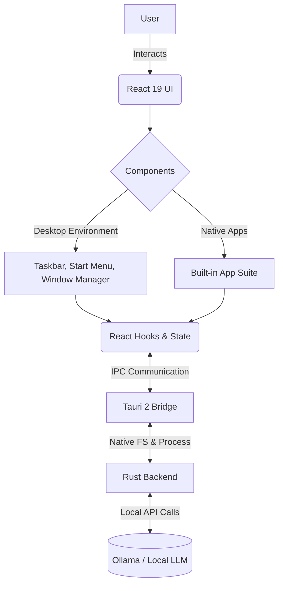

<div align="center">
  <h1>👁️ ARGUS Sovereign OS</h1>
  <p><strong>The World's First AI-Native Desktop Operating System</strong></p>

  <p>
    
    
    
    
    
    
  </p>
</div>

<br />


## ✨ Feature Highlights

✓ **Local-First AI Execution:** Powered entirely by Ollama for zero-latency, private AI inferences.  
✓ **Deep OS Integration:** AI isn't an app; it's the foundation of the desktop environment.  
✓ **Premium Glassmorphism UI:** A stunning, state-of-the-art interface blending macOS aesthetics with Windows 11 functionality.  
✓ **Robust Window Management:** Full support for dragging, resizing, Aero-style snapping, and complex Z-index stacking.  
✓ **Native Performance:** Built on Tauri 2 and Rust, keeping memory footprint remarkably low.  
✓ **Fully Featured Suite:** Comes with a comprehensive set of default applications out of the box.  

---

## 🚀 Quick Start

Get ARGUS Sovereign OS up and running in three simple steps:

```bash
# 1. Clone the repository
git clone https://github.com/janstevedaniel/argus-os.git
cd argus-os

# 2. Install dependencies
npm install

# 3. Start the development server
npm run tauri dev
```

## 🛠️ Build from Source

To compile a native executable for your system:

```bash
# Ensure Rust and Tauri prerequisites are installed
npm run build
npm run tauri build
```
The compiled binaries will be available in the `src-tauri/target/release` directory.

---

## 🏗️ Architecture

ARGUS uses a modern, high-performance web-native stack bridged with native Rust backends.



---

## 📱 Built-in Application Suite

ARGUS comes pre-loaded with a suite of essential, fully functional applications built for the AI era:

*   **💬 Chat Assistant:** Your deeply integrated copilot that sees your desktop context.
*   **🌐 Browser:** A lightweight web renderer with tab management and AI summarization.
*   **💻 Terminal:** A simulated UNIX-like filesystem terminal featuring AI command autocomplete.
*   **🧮 Calculator:** A responsive, multi-function calculator with extensive keyboard support.
*   **📝 Notes:** An auto-saving markdown notebook directly connected to your local knowledge graph.
*   **🎵 Music Player:** A sleek audio client tailored for local media libraries.
*   **🖼️ Photos:** A responsive gallery viewer for organizing visual assets.
*   **📂 File Explorer:** A smart filesystem navigator with AI metadata extraction.
*   **⚙️ Settings:** Complete control over your OS environment, appearance, and AI models.

---

## 💻 Technology Stack

| Technology | Version | Purpose |
| :--- | :--- | :--- |
| **React** | 19.x | Core UI Framework |
| **TypeScript** | 5.8 | Type-safe application logic |
| **Vite** | 7.x | Ultra-fast build tooling and HMR |
| **Tauri** | 2.x | Native OS bridging & app packaging |
| **Rust** | 2024 Edition | High-performance backend systems |
| **Ollama** | Local | Inference engine for AI components |

---

## 📅 Version History

*   **v2.0.0 (Current):** Full app suite deployment, premium glassmorphism UI, advanced window manager, and local AI integration.
*   **v1.0.0:** First functional Desktop Environment (window dragging, basic taskbar, single apps).
*   **v0.1.0:** Initial conceptual prototype and architectural foundation.

---

## 🤝 Contributing

We welcome contributions to the ecosystem! Whether it's adding new built-in apps, optimizing the window manager, or expanding the Tauri Rust bridge, your help is appreciated. 

1. Fork the Project
2. Create your Feature Branch (`git checkout -b feature/AmazingFeature`)
3. Commit your Changes (`git commit -m 'Add some AmazingFeature'`)
4. Push to the Branch (`git push origin feature/AmazingFeature`)
5. Open a Pull Request

---

## 📜 License & Credits

**Source-Available & Proprietary**
© 2026 R Jan Steve Daniel. All Rights Reserved.
This project's source is available for inspection and educational purposes but remains proprietary. 

**Creator:** [R Jan Steve Daniel](https://github.com/janstevedaniel)
