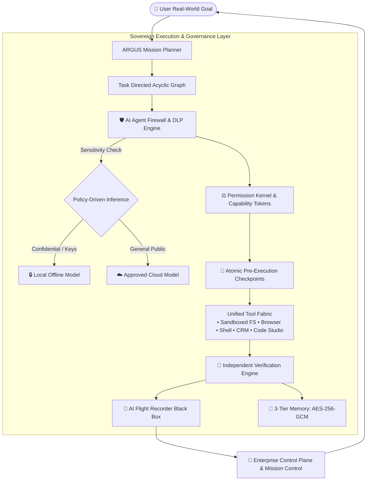

# 🌌 ARGUS — The Sovereign Agentic Computer

<div align="center">

[](https://github.com/JanSteve/ARGUS/releases/latest)
[](https://argus-sovereign-os-website.vercel.app/os/)
[](https://argus-sovereign-os-website.vercel.app/)
[](LICENSE)
[](https://github.com/JanSteve/ARGUS/actions)

### **The Sovereign Execution & Governance Platform for AI Agents**
*Turn complex real-world objectives into verified computer actions without surrendering control of your data, credentials, or applications.*

[🌐 Marketing Portal](https://argus-sovereign-os-website.vercel.app/) • [📱 Interactive Web Client](https://argus-sovereign-os-website.vercel.app/os/) • [📦 Direct macOS DMG](https://argus-sovereign-os-website.vercel.app/downloads/ARGUS_macOS.dmg) • [💼 Startup Pitch Deck](docs/startup/PITCH_DECK.md)

</div>

---

## ⚡ The Architectural Thesis

Traditional operating systems treat AI as an invasive chatbot sidebar. **ARGUS turns personal computers and workstations into governed AI execution environments**:

> **Understand a Goal ➔ Plan (DAG) ➔ Authorize (Permission Kernel) ➔ Execute via Sandboxed Tools ➔ Verify Outputs ➔ Remember Facts ➔ Report Audit Trail.**



---

## 🌟 Flagship Innovations

### 1. 🛡️ AI Agent Firewall & Data Loss Prevention (DLP)
*A firewall for AI actions rather than network packets.*
- **Zero-Leak Credential Shield:** Hard-blocks agent access to `~/.ssh`, `id_rsa`, `.env`, and private cloud tokens.
- **Sensitivity Classification:** Automatically classifies data (`LOW_PUBLIC` ➔ `CRITICAL_RESTRICTED`) and forces confidential workloads to local inference.
- **Granular Capability Tokens:** Restricts agents to scoped path and domain boundaries (e.g. `read: ~/Projects/**`, `write: ~/Projects/src/**`, `network: github.com`).

### 2. 📼 AI Flight Recorder (Aircraft Black Box)
- Records every agent session frame-by-frame: Objective, Model, Prompts, Tools, Permissions, Network Calls, and Verification Proofs.
- **Interactive Session Replayer:** Allows operators and security teams to scrub through an agent's execution timeline second-by-second.

### 3. 🔙 Atomic Checkpoints & 1-Click Rollback
- Treats AI operations like database transactions.
- Takes an atomic snapshot of workspace state prior to consequential tasks.
- Restores previous system state in 1 click if verification fails or the user cancels.

### 4. 🧠 3-Tier Sovereign Memory Architecture
- **Episodic Memory:** Immutable history of past objectives, user decisions, and execution outcomes.
- **Semantic Memory:** Extracted entity-relationship knowledge graph.
- **Working Memory:** Active DAG state and variables.
- **Authenticated Encryption:** Stored locally in an encrypted enclave using **AES-256-GCM (256-bit key, 96-bit IV)** and **PBKDF2 (100k iterations)** key derivation.

### 5. 🎯 Mission Control & Sovereign Business Agents
- **Growth & Marketing Agent:** Researches competitive landscapes and drafts multi-channel campaigns.
- **Sales & CRM Agent:** Evaluates ICP fit (0-100), organizes sales pipelines, and drafts hyper-personalized outreach.
- **Human-in-the-Loop Policy Gate:** Zero external communications or file overwrites are dispatched without explicit operator clearance.

---

## 📦 Developer SDK (`@argus/sdk`)

Developers can build native sovereign agents with scoped boundaries:

```typescript
import { ArgusSDK } from "@argus/sdk";

// 1. Define Agent Identity
const codeAgent = ArgusSDK.createAgent({
  id: "ARGUS-CODE-7F21",
  name: "Systems Code Reviewer",
  role: "Engineering Agent",
  riskTier: "MEDIUM",
  requiredCapabilities: ["filesystem", "code_sandbox"],
});

// 2. Issue Scoped Capability Token
const token = ArgusSDK.requestCapability({
  agentId: codeAgent.id,
  allowedPathsRead: ["~/Projects/ARGUS/**"],
  allowedPathsWrite: ["~/Projects/ARGUS/src/**"],
  durationMinutes: 45,
});

// 3. Create Atomic Checkpoint before Execution
const checkpoint = ArgusSDK.createCheckpoint(codeAgent.id, "Pre-refactor snapshot");
```

---

## 💻 Tech Stack

| Layer | Technology |
| :--- | :--- |
| **Desktop Shell** | Tauri 2.0 (Rust Native Bridge) |
| **UI Environment** | React 19, TypeScript 5.8, Vite 7 |
| **Styling** | Apple-Style Clean White & Dark Cyber Glassmorphism (CSS Modules) |
| **Local Inference** | Ollama Local Engine (Llama 3.2, DeepSeek-R1, Qwen 2.5 Coder) |
| **Cryptography** | AES-256-GCM Authenticated Encryption, PBKDF2 (100,000 rounds) |
| **CI/CD & Packaging** | GitHub Actions, macOS Universal DMG, Windows MSI / Exe |

---

## 🚀 Quick Start

```bash
# Clone the repository
git clone https://github.com/JanSteve/ARGUS.git
cd ARGUS

# Install dependencies
npm install

# Run in Development Mode
npm run tauri dev
```

---

## 👤 Author & Architecture

**R Jan Steve Daniel**  
Founder & Lead Architect — ARGUS Sovereign Systems  
📧 `stevedaniel2004@gmail.com` • `contact.stevedaniel@gmail.com`  
🌐 [https://argus-sovereign-os-website.vercel.app/](https://argus-sovereign-os-website.vercel.app/)

© 2026 R Jan Steve Daniel. Source-Available & Enterprise Governance Architecture.
