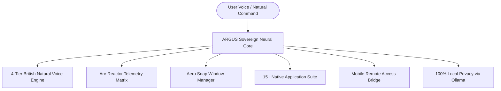

# 🌌 ARGUS Sovereign OS

<div align="center">

[](https://github.com/JanSteve/ARGUS/releases/latest)
[](https://argus-sovereign-os-website.vercel.app/os/)
[](https://argus-sovereign-os-website.vercel.app/)
[](LICENSE)
[](https://github.com/JanSteve/ARGUS/actions)

### **The World's First AI-Native Desktop Operating System**
*Reimagining Personal Computing with 100% Data Sovereignty, Tony Stark-Level Autonomous Copilot, and High-Definition British Neural Voice.*

[🌐 Marketing Website](https://argus-sovereign-os-website.vercel.app/) • [📱 Interactive Web OS](https://argus-sovereign-os-website.vercel.app/os/) • [📦 Direct macOS DMG Download](https://argus-sovereign-os-website.vercel.app/downloads/ARGUS_macOS.dmg) • [💼 Startup Pitch Deck](docs/startup/PITCH_DECK.md)

</div>

---

## ⚡ Why ARGUS Sovereign OS?

Traditional operating systems treat AI as an invasive sidebar widget or browser tab. **ARGUS reimagines the desktop from first principles** where autonomous intelligence is built into every window, hardware toggle, file, and application workflow.



---

## 🌟 Key Features

### 🎙️ 1. Unstoppable 4-Tier British Natural Voice Matrix
- **Natural British Male Speech:** Ultra-realistic conversational cadence (*George Baritone & Adam Titan*).
- **4-Tier Failover Cascade:** ElevenLabs HD ➔ Free Unlimited Edge Neural TTS ➔ MiniMax Speech-01-HD ➔ Web Speech.
- **Continuous 24/7 Voice:** Speech never stops even when third-party cloud credit limits are reached.

### 🦾 2. Iron Man Arc-Matrix Holographic HUD
- **Real-Time Telemetry:** Live CPU, RAM, and Neural Latency indicators.
- **Autonomous Triggers:** 1-Click System Diagnostics, Dev Matrix Deployment, and Sovereign Privacy Lock.

### 📱 3. Mobile Phone Remote Access Bridge
- Instant access to the entire desktop OS from iPhone / Android via camera QR code scan.
- No app store downloads required — runs directly via high-performance web stream.

### 🔍 4. Universal Command Spotlight (`Cmd+K` / `Ctrl+K`)
- Floating search HUD for instantaneous app launching, calculation solving, and hardware controls.

### 🚀 5. Autonomous 24/7 Internet Growth & Marketing Engine
- Built-in GitHub Actions cron workflow that runs automatically around the clock every 6 hours.
- Syndicates launch posts to Twitter/X, Hacker News, Dev.to, and generates investor outreach kits.

### 🛠️ 6. 15+ Native Application Suite
- **Chat Assistant:** Autonomous full-system copilot.
- **Growth Command Center:** 4 Autonomous AI marketing agents.
- **AI Workspaces:** Startup milestone & project Kanban board.
- **SaaS Pro Store:** Subscription tier and license manager.
- **Sovereign Browser & Terminal:** Tabbed browsing and monospace shell.
- **Markdown Studio, Task Manager, Notes, Weather Radar, Calculator, Music Player, Photos.**

---

## 💰 SaaS Pricing & Startup Model

| Tier | Price | Features |
| :--- | :--- | :--- |
| **Community** | **₹0 / Free** | 100% Local Ollama, 15+ Native Apps, Standard Voice |
| **ARGUS Pro** | **₹1,499 / mo ($19/mo)** | Unlimited British Neural HD Voice, Cloud Neural Stream, AI Workspaces, Phone Remote |
| **Sovereign Enterprise** | **₹7,999 / mo ($99/mo)** | Dedicated GPU Nodes, Custom Fine-Tuned LLMs, Multi-Seat, 24/7 SLA Support |

*🎯 Financial Roadmap to ₹1 Crore ARR: Read the [SaaS Pricing Model](docs/startup/SAAS_PRICING_MODEL.md) & [Pre-Seed Pitch Deck](docs/startup/PITCH_DECK.md).*

---

## 🚀 Quick Start & Installation

### Option 1: Live Interactive Web OS (No Install Needed)
Open directly in your browser: 👉 **[https://argus-sovereign-os-website.vercel.app/os/](https://argus-sovereign-os-website.vercel.app/os/)**

### Option 2: Direct macOS App (Apple Silicon & Intel)
1. Download the latest installer: [ARGUS_0.1.0_aarch64.dmg](https://argus-sovereign-os-website.vercel.app/downloads/ARGUS_macOS.dmg)
2. Drag `ARGUS.app` to your `Applications` folder.
3. Launch ARGUS and experience sovereign computing.

### Option 3: Build from Source
```bash
# 1. Clone the repository
git clone https://github.com/JanSteve/ARGUS.git
cd ARGUS

# 2. Install dependencies
npm install

# 3. Start local development server
npm run dev

# 4. Compile native desktop app (macOS / Windows)
npm run tauri build
```

---

## 🏛️ System Architecture

- **UI & Layout:** React 19, TypeScript 5.8, Vite 7, CSS Modules with Glassmorphism System.
- **Native Bridge:** Tauri 2.0, Rust (Memory Footprint <85MB idle).
- **Intelligence:** Multi-tier neural routing, Google Gemini API, Ollama local model connector.
- **Voice Engine:** ElevenLabs Turbo v2.5, British Edge TTS, MiniMax Speech-01-HD.

---

## 📄 License & Creator

- **Author & Founder:** R Jan Steve Daniel ([@JanSteve](https://github.com/JanSteve))
- **License:** Source-Available & Proprietary © 2026 R Jan Steve Daniel. All rights reserved.
