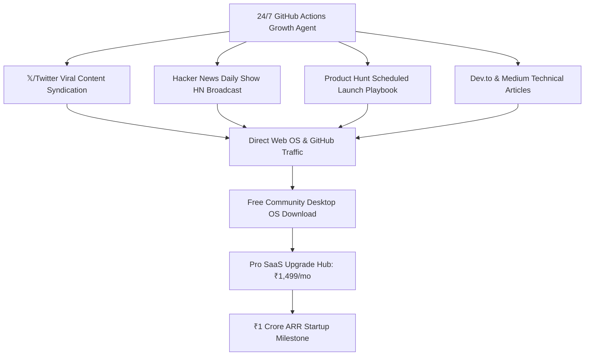

# 🌐 ARGUS Sovereign OS: Go-To-Market & 24/7 Distribution Strategy

## 1. Distribution Engine Architecture

ARGUS uses an autonomous multi-pronged growth flywheel designed for maximum organic virality and zero paid ad dependency:

---

## 2. 4-Phase Launch Playbook

### Phase 1: Developer Seed & GitHub Trending (Weeks 1–4)
- **Goal:** Reach 1,000 GitHub Stars and 5,000 Web OS preview sessions.
- **Actions:**
  - Launch `Show HN` on Hacker News.
  - Publish technical architecture breakdown on Dev.to and Reddit (`r/selfhosted`, `r/MachineLearning`).
  - Deploy GitHub Actions 24/7 automated campaign logging.

### Phase 2: Product Hunt & Viral Video Campaign (Weeks 5–8)
- **Goal:** #1 Product of the Day on Product Hunt & 10,000 app downloads.
- **Actions:**
  - 60-second high-energy video demo showcasing Iron Man Arc-Reactor voice commands.
  - Product Hunt Maker Story submission.
  - Direct download links for macOS (DMG) and Windows.

### Phase 3: SaaS Monetization & Pro Conversion (Weeks 9–16)
- **Goal:** Convert first 550 Pro subscribers to hit ₹1 Crore ARR.
- **Actions:**
  - In-OS Pro upgrade prompt after 50 voice commands.
  - Stripe / Razorpay instant checkout for Pro licenses.
  - Launch AI Workspaces & Enterprise customization modules.

### Phase 4: Pre-Seed Venture Funding (Weeks 17–24)
- **Goal:** Close ₹1 Crore (\$120k) Pre-Seed funding round.
- **Actions:**
  - Pitch 25 targeted AI angel investors using the 12-slide Pitch Deck.
  - Accelerate engineering team expansion and dedicated GPU cluster deployment.
